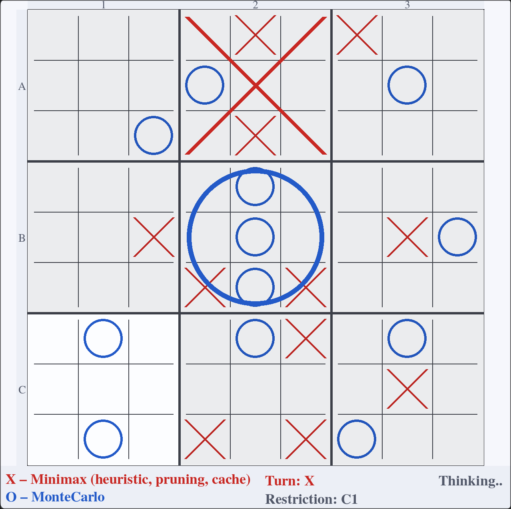

Ultimate Tic Tac Toe AI Arena
=============================

Ultimate Tic Tac Toe AI Arena is a playground where people can play Ultimate
Tic Tac Toe against AI or pit different AI algorithms against each other.
Players can choose the algorithm and tune its parameters.

Rules reference: `https://en.wikipedia.org/wiki/Ultimate_tic-tac-toe`



Index
-----

- [Run](#run)
- [Implemented Algorithms (So Far)](#implemented-algorithms-so-far)
- [Algorithm Details and Params](#algorithm-details-and-params)


Run
---

Option A (recommended): use `uv`
```bash
uv run src/main.py
```

Option B: install dependencies and run with Python
```bash
python3 -m pip install -r pyproject.toml
python3 src/main.py
```

Implemented Algorithms (So Far)
-------------------------------

Work in progress: I plan to add more algorithms in the future.

- [x] Minimax
- [x] Heuristic Minimax
- [x] Alpha-Beta Pruning
- [x] Monte Carlo Tree Search (MCTS)
- [ ] Tabular Q-Learning
- [ ] Basic reinforcement learning via self-play
- [ ] Deep Q-Network (DQN)
- [ ] Policy Gradient (REINFORCE or PPO)
- [ ] RL + MCTS

Algorithm Details and Params
----------------------------

- Minimax: depth-limited search of game states with optional heuristic evaluation
  and alpha-beta pruning.

  | Param | Meaning |
  | --- | --- |
  | Depth | Search depth (higher = stronger, slower). |
  | Heuristic | Enable board evaluation at depth limit. |
  | Pruning | Enable alpha-beta pruning to cut branches. |

- Monte Carlo Tree Search (MCTS): random rollouts from the current state to estimate move strength.

  | Param | Meaning |
  | --- | --- |
  | Nr of sims | Number of simulations per move (higher = stronger, slower). |
