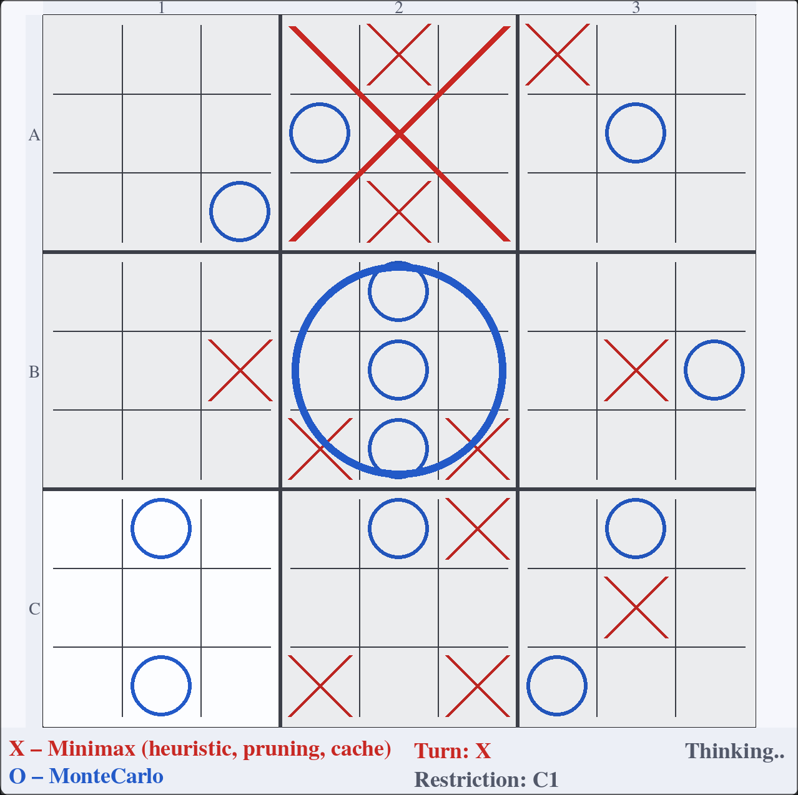

Ultimate Tic Tac Toe AI Arena
=============================

Ultimate Tic Tac Toe AI Arena is a playground where people can play Ultimate
Tic Tac Toe against AI or pit different AI algorithms against each other.
Players can choose the algorithm and tune its parameters.

Rules reference: `https://en.wikipedia.org/wiki/Ultimate_tic-tac-toe`



Index
-----

- [Run the Game](#run-the-game)
- [Training Q-Learning](#training-q-learning)
- [Implemented Algorithms](#implemented-algorithms)
- [Algorithm Details and Params](#algorithm-details-and-params)


Run the Game
------------

Option A (recommended): use `uv`
```bash
uv run src/main.py
```

Option B: install dependencies and run with Python
```bash
python3 -m pip install -r pyproject.toml
python3 src/main.py
```

From the menu, select an algorithm for each player and press **Start Game** (or Enter).


Training Q-Learning
-------------------

Q-Learning requires offline self-play training before it can play well.
The training script runs headlessly (no GUI) and saves a `q_table.pkl` file
in the project root. Once trained, selecting **Q-Learning** in the game menu
automatically loads the model.

**Train** (self-play, parallelized across all CPU cores by default):
```bash
uv run scripts/train_qlearning.py train
```

The default is 100,000 episodes. For stronger play use more:
```bash
uv run scripts/train_qlearning.py train --episodes 1000000
```

**Resume** training from an existing model:
```bash
uv run scripts/train_qlearning.py train --load q_table.pkl --episodes 1000000
```

**Evaluate** the trained model against a random opponent:
```bash
uv run scripts/train_qlearning.py eval --episodes 1000
```

Training options:

| Flag | Default | Meaning |
| --- | --- | --- |
| `--episodes` | 100000 | Number of self-play games |
| `--workers` | all cores | Parallel workers (each runs episodes/workers games) |
| `--alpha` | 0.3 | Learning rate |
| `--gamma` | 0.9 | Discount factor (how much future rewards matter) |
| `--epsilon-start` | 1.0 | Initial exploration rate (1.0 = fully random) |
| `--epsilon-end` | 0.05 | Final exploration rate after decay |
| `--epsilon-decay` | 80000 | Episodes over which epsilon decays |
| `--save` | q_table.pkl | Where to save the trained model |
| `--load` | — | Resume training from an existing model |
| `--report-interval` | 10000 | Print stats every N episodes per worker |


Implemented Algorithms
----------------------

Work in progress: I plan to add more algorithms in the future.

- [x] Minimax
- [x] Heuristic Minimax
- [x] Alpha-Beta Pruning
- [x] Monte Carlo Tree Search (MCTS)
- [x] Tabular Q-Learning
- [ ] Deep Q-Network (DQN)
- [ ] Policy Gradient (REINFORCE or PPO)
- [ ] RL + MCTS


Algorithm Details and Params
----------------------------

- **Minimax**: depth-limited search of game states with optional heuristic evaluation
  and alpha-beta pruning.

  | Param | Meaning |
  | --- | --- |
  | Depth | Search depth (higher = stronger, slower). |
  | Heuristic | Enable board evaluation at depth limit. |
  | Pruning | Enable alpha-beta pruning to cut branches. |

- **Monte Carlo Tree Search (MCTS)**: random rollouts from the current state to estimate move strength.

  | Param | Meaning |
  | --- | --- |
  | Nr of sims | Number of simulations per move (higher = stronger, slower). |

- **Q-Learning**: trained offline via self-play. Loads `q_table.pkl` from the project root.
  If no model file is found, plays randomly. See [Training Q-Learning](#training-q-learning).
